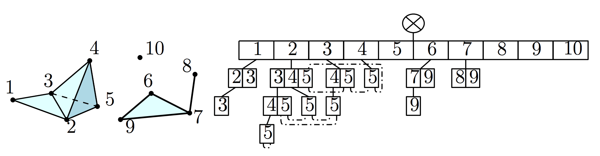

# simplextree
[](https://ci.appveyor.com/project/peekxc/simplextree)
[](https://travis-ci.org/peekxc/simplextree)
[](https://travis-ci.org/peekxc/simplextree)

`simplextree` is an [R](https://www.r-project.org/) package aimed at simplifying computation for general [simplicial complexes](https://en.wikipedia.org/wiki/Simplicial_complex) of any dimension. This package facilitates this aim by providing R bindings to a _Simplex Tree_ data structure, implemented using _modern_ [C++11](http://www.open-std.org/jtc1/sc22/wg21/docs/papers/2013/n3690.pdf) and exported as a [Rcpp module](https://cran.r-project.org/web/packages/Rcpp/vignettes/Rcpp-modules.pdf). The underlying library implementation also exports a [C++ header](inst/include/simplextree.h), which can be specified as a dependency and [used in other packages](#usage-with-rcpp) via [Rcpp attributes](http://dirk.eddelbuettel.com/code/rcpp/Rcpp-attributes.pdf).

The Simplex Tree was originally introduced in the following paper: 

> Boissonnat, Jean-Daniel, and Clément Maria. "The simplex tree: An efficient data structure for general simplicial complexes." Algorithmica 70.3 (2014): 406-427.

A _Simplex Tree_ is an ordered, [trie](https://en.wikipedia.org/wiki/Trie)-like structure whose nodes are in bijection with the faces of the complex. Here's a picture (taken from the paper) of a simplicial 3-complex (left) and its corresponding _Simplex Tree_ (right):


 
## Installation 
The current development version can be installed with the [devtools](https://github.com/r-lib/devtools) package: 

```R
require("devtools")
devtools::install_github("peekxc/simplextree")
```

A stable CRAN release is planned for the future. 

## Quickstart

```R
library(simplextree)
st <- simplex_tree() ## instantiation wrapper
st$insert(list(1:3, 4:5, 6)) ## Inserts { 1, 2, 3 }, { 4, 5 }, and { 6 }

## Summary of complex
print(st) 
# Simplex Tree with (6, 4, 1) (0, 1, 2)-simplices

## More detailed look at structure
st$print_tree()
# 1 (h = 2): .( 2 3 )..( 3 )
# 2 (h = 1): .( 3 )
# 3 (h = 0): 
# 4 (h = 1): .( 5 )
# 5 (h = 0): 
# 6 (h = 0): 

## Print the set of simplices making up the star of the simplex '2'
st$traverse(2, function(simplex){ print(simplex) }, "star")
# [1] 1 2
# [1] 1 2 3
# [1] 2
# [1] 2 3

## Retrieves list of all simplices in DFS order, starting with the empty face 
dfs_list <- st$ltraverse(empty_face, identity, "dfs")

## Get connected components 
print(st$connected_components)
# [1] 1 1 1 4 4 5

## Serialization/persistent storage options available
print(st$serialize())
# [[1]]
# [1] 1 2 3
# [[2]]
# [1] 4 5
# [[3]]
# [1] 6

## As are various export options
list_of_simplices <- st$as_list()
adj_matrix <- st$as_adjacency_matrix()
# ... see also as_adjacency_list(), as_edge_list
```

## API Reference 

Below is the API reference for the R-bindings of the _SimplexTree_ class. A _SimplexTree_ object can also be passed, manipulated, and modified via C++ in another R package as well. See [Usage with Rcpp](#usage-with-rcpp). 

In what follows, individual _simplex_'s are assumed to be [integer](https://stat.ethz.ch/R-manual/R-devel/library/base/html/integer.html) vectors. [Numeric](https://stat.ethz.ch/R-manual/R-devel/library/base/html/numeric.html) vectors are implicitly cast to integer vectors. Some methods accept multiple _simplices_ as well, which can be specified as a list of integer vectors. 

### SimplexTree

<a href='#simplex_tree' id='simplex_tree' class='anchor' aria-hidden='true'>#</a>
__simplex\_tree__()

Wrapper for constructing a _SimplexTree_ instance. See below. 

<a href='#SimplexTree' id='SimplexTree' class='anchor' aria-hidden='true'>#</a>
__SimplexTree__ (_C++ Class_)

Exposed binding for an internal _SimplexTree_ C++ class. The binding is exposed as an [Rcpp Module](http://dirk.eddelbuettel.com/code/rcpp/Rcpp-modules.pdf). Module instances are of the class type _Rcpp\_SimplexTree_. 

_SimplexTree_ instances can be created with either `simplex_tree()` or `new(SimplexTree)`.

#### Fields 

Fields are data attributes associated with the _SimplexTree_ instance containing useful information about the simplex tree. Writeable fields can be set by the user to change the behaviour of certain methods, whereas read-only fields are automatically updated as the tree is modified.

<a href='#n_simplices' id='n_simplices' class='anchor' aria-hidden='true'>#</a>
_SimplexTree_ $ **n\_simplices** 

An integer vector, where each index *k* denotes the number of (*k-1*)-simplices. _( Read-only )_

<a href='#dimension' id='dimension' class='anchor' aria-hidden='true'>#</a>
_SimplexTree_ $ **dimension**

The dimension of a simplicial complex *K* is the highest dimension of any of *K*'s simplices.  _( Read-only )_

<a href='#id_policy' id='id_policy' class='anchor' aria-hidden='true'>#</a>
_SimplexTree_ $ **id_policy**

The _id\_policy_  of the _SimplexTree_ instance determines how new vertex ids are generated by the [generate_ids](#generate_ids) method. Can be either "compressed" or "unique". Defaults to "compressed".  

#### Properties 

Properties are aliases to methods that act as data fields, but on access dynamically generate and return their values, much like [active bindings](https://stat.ethz.ch/R-manual/R-devel/library/base/html/bindenv.html) in R. Unlike _fields_, properties do not store their results with the instance, and do not contribute to the memory footprint of the simplicial complex.

<a href='#connected_components' id='connected_components' class='anchor' aria-hidden='true'>#</a>
_SimplexTree_ $ **connected_components**

Returns the connected components of the simplicial complex. 

Each connected component is associated with an integer; the result of this function is an integer vector mapping the (ordered) set vertices to their corresponding connected component.  

<a href='#vertices' id='vertices' class='anchor' aria-hidden='true'>#</a>
_SimplexTree_ $ **vertices**

Returns the 0-simplices in the simplicial complex as an _n_-length vector, where _n_ is the number of 0-simplices.

<a href='#edges' id='edges' class='anchor' aria-hidden='true'>#</a>
_SimplexTree_ $ **edges**
 
Returns the 1-simplices in the simplicial complex as an _( n x 2 )_ matrix, where _n_ is the number of 1-simplices.

<a href='#triangles' id='triangles' class='anchor' aria-hidden='true'>#</a>
_SimplexTree_ $ **triangles**
 
Returns the 2-simplices in the simplicial complex as an _( n x 3 )_ matrix, where _n_ is the number of 2-simplices.

<a href='#quads' id='quads' class='anchor' aria-hidden='true'>#</a>
_SimplexTree_ $ **quads**
 
Returns the 3-simplices in the simplicial complex as an _( n x 4 )_ matrix, where _n_ is the number of 3-simplices.


#### Modifying the tree 

<a href='#insert' id='insert' class='anchor' aria-hidden='true'>#</a>
_SimplexTree_ $ **insert**(\[*simplices*\])

Inserts *simplices* into the simplex tree. Each _simplex_ is ordered prior to insertion. If a _simplex_ already exists, the tree is not modified. To keep the property of being a simplex tree, the proper faces of _simplex_ are also inserted. 

Note that the _SimplexTree_ structure does not track orientation, e.g. the simplices _(1, 2, 3)_ and _(2, 1, 3)_ are considered identical. 

<details>
	<summary> Insertion examples </summary>
	
	```R
	st <- simplex_tree()
	st$insert(c(1, 2, 3)) ## insert the simplex { 1, 2, 3 }
	st$insert(list(c(4, 5), 6)) ## insert the simplices { 4, 5 } and { 6 }
	print(st)
	# Simplex Tree with (6, 4, 1) (0, 1, 2)-simplices
	```
	
</details>

<a href='#remove' id='remove' class='anchor' aria-hidden='true'>#</a>
_SimplexTree_ $ **remove**(\[*simplices*\])

Removes *simplices* from the simplex tree. Each _simplex_ is ordered prior to removal. If a _simplex_ doesn't exist, the tree is not modified. To keep the property of being a simplex tree, the cofaces of _simplex_ are also removed. 

<details>
	<summary> Removal examples </summary>
	
	```R
	st <- simplex_tree()
	st$insert(list(c(1, 2, 3), c(4, 5), 6))
	st$remove(c(2, 3)) ## { 2, 3 } and { 1, 2, 3 } both removed
	print(st)
	# Simplex Tree with (6, 4, 1) (0, 1, 2)-simplices
	```
	
</details>

<a href='#contract' id='contract' class='anchor' aria-hidden='true'>#</a>
_SimplexTree_ $ **contract**(\[*a, b*\])

Performs and *edge contraction*, contracting vertex *b* to vertex *a*. This is equivalent to removing vertex *b* from the simplex tree and augmenting the link of vertex *a* with the link of vertex *b*. If the edge does not exist in the tree, the tree is not modified.

<details>
	<summary> Contraction example </summary>
	
  ```R
  st <- simplex_tree()
  st$insert(1:3)
  st$print_tree()
  # 1 (h = 2): .( 2 3 )..( 3 )
  # 2 (h = 1): .( 3 )
  # 3 (h = 0): 
  st$contract(c(1, 3))
  st$print_tree()
  # 1 (h = 1): .( 2 )
  # 2 (h = 0):
	```

</details>

<a href='#collapse' id='collapse' class='anchor' aria-hidden='true'>#</a>
_SimplexTree_ $ **collapse**(...)

1. (\[_tau_\], \[_sigma_\])
2. (_u_, _v_, _w_)

Performs an _elementary collapse_. There are multiple simplifying operations that have been referred to as elementary collapses; this method provides two such operations.

(1) elementary collapse ( from [1](#simplex-tree-paper) ) 

Collapses _tau_ through its coface _sigma_ if _sigma_ is the only coface of _tau_, where _tau_ and _sigma_ are both _simplexes_. 

(2) vertex collapse ( from [2](#simplicial-map-paper) )

Collapses a free pair (_u_, _v_) -> (_w_), where _u_, _v_, and _w_ are all _vertices_. 

Note that an _elementary_ collapse in this sense has an injectivity requirement that either _u_ = _w_, such that (_u_, _v_) -> (_u_), or _v_ = _w_, such that (_u_, _v_) -> (_v_). If (_u_, _v_) -> (_w_) is specified, where _u_ != _w_ and _v_ != _w_ , the collapse is decomposed into two elementary collapses, (_u_, _w_) -> (_w_) and (_v_, _w_) -> (_w_), and both are performed. 

<details>
	<summary> Collapse example </summary>
	
  ```R
  st <- simplex_tree()
  st$insert(1:3)
  st$print_tree()
  # 1 (h = 2): .( 2 3 )..( 3 )
  # 2 (h = 1): .( 3 )
  # 3 (h = 0): 
  st$collapse(1:2, 1:3) ## collapse in the sense of (1)
  st$print_tree()
  # 1 (h = 1): .( 3 )
  # 2 (h = 1): .( 3 )
  # 3 (h = 0):
  
  st$insert(list(1:3, 2:5))
  st$print_tree()
  # 1 (h = 2): .( 2 3 )..( 3 )
  # 2 (h = 3): .( 3 4 5 )..( 4 5 5 )...( 5 )
  # 3 (h = 2): .( 4 5 )..( 5 )
  # 4 (h = 1): .( 5 )
  # 5 (h = 0): 
  st$collapse(3, 4, 5) ## collapse in the sense of (2)
  st$print_tree()
  # 1 (h = 2): .( 2 5 )..( 5 )
  # 2 (h = 2): .( 5 )..( 5 )
  # 5 (h = 1): .( 5 )
	```
	
</details>

<a href='#expand' id='expand' class='anchor' aria-hidden='true'>#</a>
_SimplexTree_ $ **expand**(_k_)

Performs a _k-expansion_, constructing the _k_-skeleton as a flag complex. The expansion is performed by successively inserting all the simplices of _k_-skeleton into the tree. 

This method assumes the dimension of the simplicial complex before expansion is 1. 

<details>
	<summary> Expansion example </summary>
  
  ```R
  st <- simplex_tree()
  st$insert(list(c(1, 2), c(2, 3), c(1, 3)))
  st$print_tree()
  # 1 (h = 1): .( 2 3 )
  # 2 (h = 1): .( 3 )
  # 3 (h = 0):
  
  st$expand(k=2) ## expand to simplicial 2-complex
  st$print_tree()
  # 1 (h = 2): .( 2 3 )..( 3 )
  # 2 (h = 1): .( 3 )
  # 3 (h = 0): 
	```
	
</details>

<a href='#as_XPtr' id='as_XPtr' class='anchor' aria-hidden='true'>#</a>
_SimplexTree_ $ **as_XPtr**()

Converts the simplex tree into an [XPtr](https://github.com/RcppCore/Rcpp/blob/master/inst/include/Rcpp/XPtr.h), sometimes called an _external pointer_. _XPtr_'s can be passed as an [SEXP](https://cran.r-project.org/doc/manuals/r-release/R-ints.html#SEXPs) to other C/C++ functions via R's C API or Rcpp. For usage, see [Usage with Rcpp](#usage-with-rcpp).

This method does _not_ register a delete finalizer. 

#### Querying the tree 

<a href='#print_tree' id='print_tree' class='anchor' aria-hidden='true'>#</a>
_SimplexTree_ $ **print_tree**()

Prints the simplicial complex to _standard out_. By default, this is set to R's buffered output, which is shown in the R console. The printed format is: 

> \[*vertex*\] (h = \[*subtree height*\]): \[*subtree depth*\](\[*subtree*\])

Where each line corresponds to a *vertex* and its corresponding subtree. The *subtree depth* represents the set of _sibling_ *k*-simplices at that level in tree, represented by a sequence of dots ('**.**').  

<a href='#find' id='find' class='anchor' aria-hidden='true'>#</a>
_SimplexTree_ $ **find**(\[*simplices*\])

Traverses the simplex tree downard starting at the root by successively using each of the ordered labels in _simplex_ as keys. Returns a logical indicating whether _simplex_ was found, for each _simplex_ in _simplices_. Each _simplex_ is sorted prior to traversing. 

<a href='#degree' id='degree' class='anchor' aria-hidden='true'>#</a>
_SimplexTree_ $ **degree**(\[*vertices*\])

Returns the degree of a given vertex or set of vertices.

<a href='#adjacent' id='adjacent' class='anchor' aria-hidden='true'>#</a>
_SimplexTree_ $ **adjacent**(_vertex_)

Returns the set of vertices adjacent to a given _vertex_. 

<a href='#is_face' id='is_face' class='anchor' aria-hidden='true'>#</a>
_SimplexTree_ $ **is_face**(_[tau]_, _[sigma]_)

Returns a logical indicating whether tau is a face of sigma. 

<a href='#is_tree' id='is_tree' class='anchor' aria-hidden='true'>#</a>
_SimplexTree_ $ **is_tree**()

Returns a logical indicating whether the simplex tree is fully connected and acyclic. 

<a href='#generate_ids' id='generate_ids' class='anchor' aria-hidden='true'>#</a>
_SimplexTree_ $ **generate_ids**(_n_)

Generates _n_ new vertex ids which do not exist in the tree according to the current _id\_policy_. 

#### Traversals

The _SimplexTree_ data structure supports various types of _traversals_. A _traversal_ is a (possibly optimized) path that allows iteration through a subset of the _SimplexTree_. The traversal _type_  determines the subset and path to iterate through. During the traversal, each simplex is passed to _f_ as its only argument. 

<a href='#traverse' id='traverse' class='anchor' aria-hidden='true'>#</a>
_SimplexTree_ $ **traverse** <br /> 

1. (_f_, _type_)
2. (\[_simplex_\], _f_, _type_)
3. (\[_simplex_\], _f_, _type_, _params_)

The **traverse** method has three overloads, based on the traversal _type_ and intended usage of _f_.

(1) applies _f_ to each simplex in the traversal path _type_, starting at the root of the tree. 

(2) applies _f_ to each simplex in the traversal path _type_ , starting at the specified _simplex_ in the tree. The root simplex (empty face) may be specified using the _empty\_face_ alias or the _NULL_ keyword. 

(3) applies _f_ to each simplex in the traversal path _type_, starting at the specified _simplex_ in the tree.
The root simplex (empty face) may be specified using the _NULL_ keyword or the _empty\_face_ alias. Additional parameters may be supplied to the traversal _type_ as via _params_ as a list. 

<details>
	<summary> Traversal Examples </summary>

	Traverse using first overload (performs depth-first traversal on simplex tree): 
		
	```R
	st <- simplex_tree()
	st$insert(1:3)
	st$traverse(message, "dfs") # equivalent to 'st$traverse(NULL, message, "dfs")'
	# (empty face)
	# 1
	# 12
	# 123
	# 13
	# 2
	# 23
	# 3
	```
	
	Traverse using second overload (prints the cofaces of the vertex with label '1'): 
		
	```R
	st$traverse(1, message, "cofaces")
	# 1
	# 12
	# 123
	# 13
	```
	
	Traverse using third overload (prints the 1-simplices): 
	
	```R
	st$traverse(1, message, "maximal-skeleton", list(k=1))
	# 1
	# 12
	# 123
	# 13
	```
</details>

<a href='#ltraverse' id='ltraverse' class='anchor' aria-hidden='true'>#</a>
_SimplexTree_ $ **ltraverse**(...)

Performs a _traversal_, returning a list of the same length as the traversal path, with each element containing the result of _f_. The parameters *...* are the same as in [traverse](#traverse). **ltraverse** is meant to used in a similar way as lapply.

##### Traversal types

The _type_ parameter passed to the traverse family of algorithms determines the subset and corresponding path that is enumerated in simplex tree. A traversal _type_ is specified by a string, and its corresponding _params_ are specified in a list. The currently supported traversal types are as follows: 

<a href='#dfs' id='dfs' class='anchor' aria-hidden='true'>#</a> _type_ = "**dfs**" 

Performs a depth-first traversal of the _SimplexTree_ starting at _simplex_. If _simplex_ is not supplied, the traversal starts at the root node.

<a href='#bfs' id='bfs' class='anchor' aria-hidden='true'>#</a> _type_ = "**bfs**" 

Performs a breadth-first traversal of the _SimplexTree_ starting at _simplex_. If _simplex_ is not supplied, the traversal starts at the root node.

<a href='#cofaces' id='cofaces' class='anchor' aria-hidden='true'>#</a> _type_ = "**cofaces**" or _type_ = "**star**"

Traverse all of the cofaces (the star) of _simplex_ in the _SimplexTree_. If _simplex_ is not supplied, the traversal starts at the root node.

<a href='#link' id='link' class='anchor' aria-hidden='true'>#</a> _type_ = "**link**"

Traverse all of the link of _simplex_ in the _SimplexTree_. If _simplex_ is not supplied, the traversal starts at the root node.

<a href='#skeleton' id='skeleton' class='anchor' aria-hidden='true'>#</a> _type_ = "**skeleton**"

Traverses all of simplices in the the _k-skeleton_ of the _SimplexTree_, where the dimension _k_ must be supplied via _params_. If _simplex_ is not supplied, the traversal starts at the root node.

<a href='#maximal-skeleton' id='maximal-skeleton' class='anchor' aria-hidden='true'>#</a> _type_ = "**maximal-skeleton**"

Traverses all of simplices in the the _maximal k-skeleton_ of the _SimplexTree_, where the dimension _k_ must be supplied via _params_. If _simplex_ is not supplied, the traversal starts at the root node.

#### Import / Export options 

<a href='#serialize' id='serialize' class='anchor' aria-hidden='true'>#</a> _SimplexTree_ $ **serialize**()

Serializes the simplex tree _K_ into a minimal set of maximal faces of _K_ needed to recover the simplex tree. Returns the set as list of simplices.

<a href='#deserialize' id='deserialize' class='anchor' aria-hidden='true'>#</a> _SimplexTree_ $ **deserialize**()

Deserializes a list of simplices by successively inserting them into the simplex tree.

<a href='#save' id='save' class='anchor' aria-hidden='true'>#</a> _SimplexTree_ $ **save**(_filename_)

Saves a serialized version the simplex tree to _filename_ in the [RDS](https://www.rdocumentation.org/packages/base/versions/3.6.0/topics/readRDS) file.

<a href='#load' id='load' class='anchor' aria-hidden='true'>#</a> _SimplexTree_ $ **load**(_filename_)

Loads a [RDS](https://www.rdocumentation.org/packages/base/versions/3.6.0/topics/readRDS) file saved to _filename_ into 
the simplex tree.

#### Conversions

The full simplicial complex can always be converted to a list of matrices, and the 1-skeleton can also be converted to any of the standard graph representations. 

<a href='#as_list' id='as_list' class='anchor' aria-hidden='true'>#</a>
_SimplexTree_ $ **as\_list**()

Converts the simplex tree to list of _(n x k)_ matrices, where each matrix represents the set of _k-1_ simplices.

<a href='#as_edge_list' id='as_edge_list' class='anchor' aria-hidden='true'>#</a>
_SimplexTree_ $ **as\_edge_list**()

Converts the 1-skeleton to an edge list. 

<a href='#as_adjacency_list' id='as_adjacency_list' class='anchor' aria-hidden='true'>#</a>
_SimplexTree_ $ **as\_adjacency_list**()

Converts the 1-skeleton to an adjacency list. 

<a href='#as_adjacency_matrix' id='as_adjacency_matrix' class='anchor' aria-hidden='true'>#</a> _SimplexTree_ $ **as\_adjacency_matrix**()

Converts the 1-skeleton to an adjacency matrix. 

## Usage with Rcpp

There are two ways to use a _SimplexTree_ object with Rcpp. 

#### 1. Pure Rcpp

If you're developing purely in Rcpp, you can just use the _SimplexTree_ class directly. The _SimplexTree_ is header-only, and can be imported via the **Rcpp::depends** attribute (see [Rcpp Attributes](http://dirk.eddelbuettel.com/code/rcpp/Rcpp-attributes.pdf))

<details> 
<summary>Example Usage in Rcpp</summary>

```C
#include "Rcpp.h"

// [[Rcpp::depends(simplextree)]]
#include "simplextree.h"

void my_function(){
  SimplexTree st = SimplexTree();
  ...
}

```
If you're developing using a package, make sure to add `simplextree` to the `LinkingTo` list to ensure the header is properly included (e.g. `-I"<...>/simplextree/include"` should appear in the build steps).

</details>

#### 2. Moving between R and Rcpp

A _SimplexTree_ Rcpp module can be passed directly from R to any Rcpp method. To do so, export the object as an external pointer (XPtr) in R, pass the [SEXP](https://cran.r-project.org/doc/manuals/r-release/R-ints.html#SEXPs) directly to the method, then wrap as as [smart external pointer](http://dirk.eddelbuettel.com/code/rcpp/html/classRcpp_1_1XPtr.html) on the C++ side. 

<details> 
<summary>Example Usage with R and Rcpp</summary>

For example, on the C++ side, one might do:
 
```C
// my_source.cpp
#include "Rcpp.h"

// [[Rcpp::depends(simplextree)]]
#include "simplextree.h"

[[Rcpp::export]]
void modify_tree(SEXP stree){
  Rcpp::XPtr<SimplexTree> stree_ptr(stree);
  stree_ptr->print_tree();
  ....
}
```
Then on the R-side, use [as\_XPtr](#as\_XPtr) method to get an [XPtr](https://cran.r-project.org/doc/manuals/R-exts.html#External-pointers-and-weak-references). 

```R
# my_source.R
stree <- simplextree::simplex_tree()
modify_tree(stree$as_XPtr())
```  
Note that the C++ class contains a superset of the functionality exported to R, however they do not necessarily have the same bindings. See the header file for a complete list. 

</details> 

## References 

> <a name="simplex-tree-paper">1.</a> Boissonnat, Jean-Daniel, and Clément Maria. "The simplex tree: An efficient data structure for general simplicial complexes." Algorithmica 70.3 (2014): 406-427. 

> <a name="simplicial-map-paper">2.</a> Dey, Tamal K., Fengtao Fan, and Yusu Wang. "Computing topological persistence for simplicial maps." Proceedings of the thirtieth annual symposium on Computational geometry. ACM, 2014.

## Visualizing the complex

Summarizing the complex can be achieved via either the overridden [S3](https://stat.ethz.ch/R-manual/R-devel/library/methods/html/Methods_for_S3.html) print generic or the more detailed [print_tree](#print_tree) method.

```R
library(simplextree)
st <- simplex_tree()
st$insert(list(1:3, 3:6))

print(st)
# Simplex Tree with (6, 9, 5, 1) (0, 1, 2, 3)-simplices

st$print_tree()
# 1 (h = 2): .( 2 3 )..( 3 )
# 2 (h = 1): .( 3 )
# 3 (h = 3): .( 4 5 6 )..( 5 6 6 )...( 6 )
# 4 (h = 2): .( 5 6 )..( 6 )
# 5 (h = 1): .( 6 )
# 6 (h = 0): 
```

Alternatively, the plot generic is also overridden for _SimplexTree_ objects (of class type 'Rcpp_SimplexTree') to display the complex with [base graphics](https://stat.ethz.ch/R-manual/R-devel/library/graphics/html/graphics-package.html).

```R
st$insert(list(6:7, 7:8, 8:10, 11:12))
plot(st)
```


There are many other options for controlling how the complex is displayed (e.g. the positions of the simplices, the sizes/linewidths of the vertices/edges, the vertex labels, whether to color only maximal faces or individual simplices, etc.). For the full documentation, see `?plot.simplextree`.

## More information 

The full documentation for both the plot package is available in the man pages.

```R
## see ?simplextree
```
